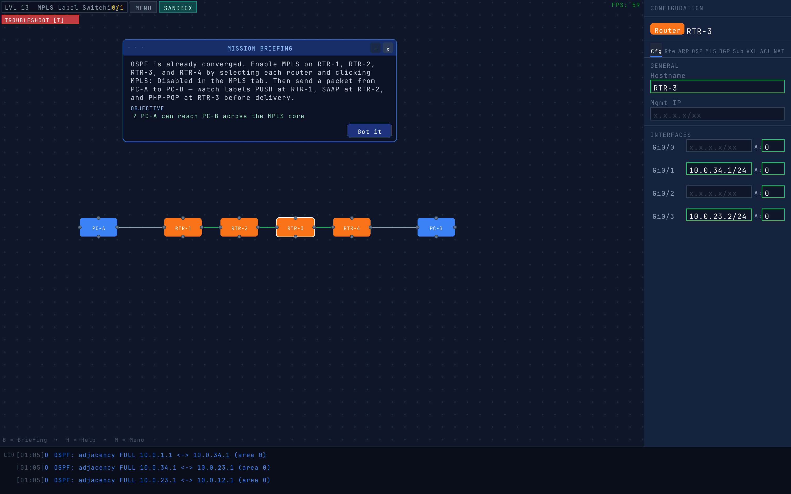
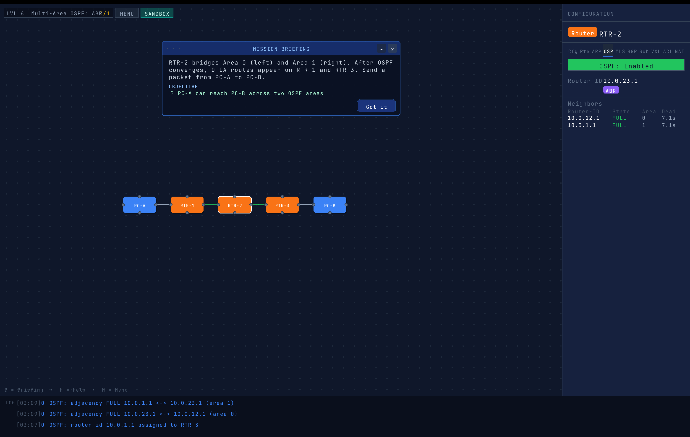
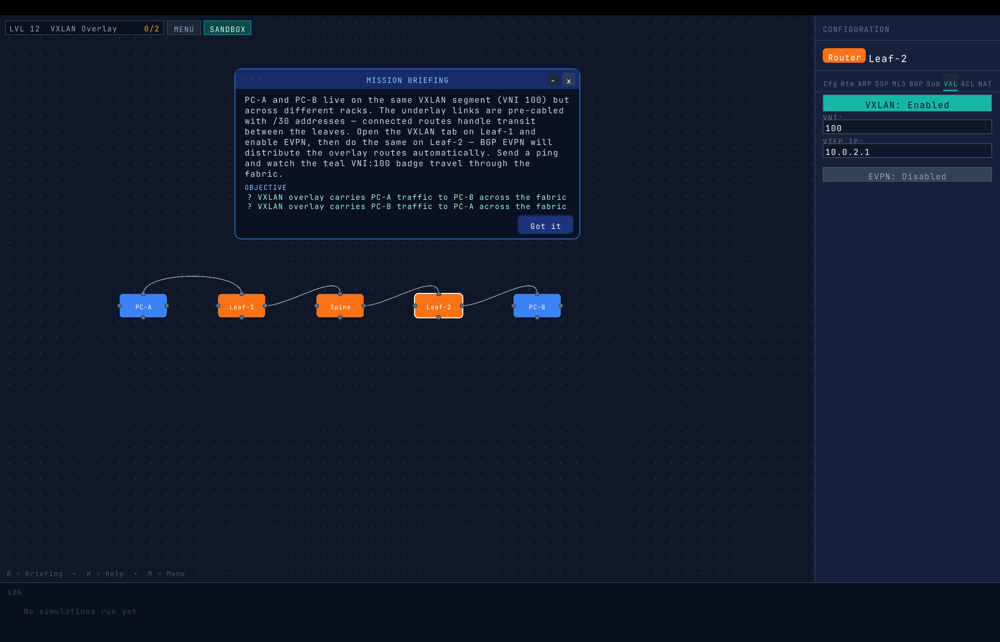

# Packet Path

A visual, interactive network simulator that teaches real networking concepts — from basic IP forwarding through OSPF, BGP, MPLS, VLANs, VXLANs, ACLs, and beyond. Built in C++17 with [raylib](https://www.raylib.com/).

---







---

## What It Is

Packet Path is a scenario-based learning game where you configure real network topologies and watch packets animate through them in real time. Every routing decision, label swap, ARP resolution, and ACL hit is shown visually and logged — so you can see exactly why a packet succeeded or was dropped.

It is not a toy model. The simulation engine runs real protocol behavior: OSPF SPF, BGP path selection, MPLS label distribution via LDP, 802.1Q VLAN tagging, VXLAN + BGP EVPN, stateful ACL evaluation, and NAT. The goal is to build intuition for how these protocols actually work, not just what they're called.

---

## Levels

| # | Title | Concepts |
|---|---|---|
| 1 | Basic Ping | IP forwarding, ARP, static routes |
| 2 | Multi-Hop Routing | Default gateway, multi-hop paths |
| 3 | Router-on-a-Stick | Inter-VLAN routing, subinterfaces |
| 4 | VLAN Trunking | 802.1Q, trunk vs access ports, VLAN isolation |
| 5 | OSPF: Single Area | OSPF hello, adjacency FSM, SPF, RIB |
| 6 | Multi-Area OSPF: ABR | Area 0 backbone, ABRs, inter-area routes |
| 7 | iBGP Full Mesh | iBGP sessions, next-hop-self, OSPF underlay |
| 8 | eBGP Peering | AS numbers, eBGP sessions, prefix advertisement |
| 9 | BGP Route Reflection | RR topology, client/non-client, cluster IDs |
| 10 | ACL Firewall | Access control lists, permit/deny rules |
| 11 | VXLAN Overlay | VXLAN encapsulation, VNI, overlay vs underlay |
| 12 | NAT: Internet Access | PAT/overload NAT, address translation |
| 13 | MPLS Label Switching | LDP, label push/swap/pop, LSP |
| 14 | Link Down | Failure detection, OSPF reconvergence |
| 15 | VLAN Gateway Down | Failure isolation, partial connectivity |
| 16 | Dual Failure | Multi-failure troubleshooting |

---

## Features

**Simulation**
- Animated packet movement along bezier cable curves
- ARP resolution with request/reply/cache behavior
- Hop-by-hop forwarding with per-device RIB/FIB
- OSPF: hello timers, adjacency state machine (Down → Init → 2-Way → Full), LSDB, Dijkstra SPF
- BGP: eBGP/iBGP sessions, route reflection, path selection
- MPLS/LDP: label distribution, push/swap/pop at each LSR
- 802.1Q: trunk/access ports, VLAN tag handling, frame forwarding
- VXLAN + BGP EVPN: overlay encapsulation, MAC/IP route advertisement
- ACL: ordered permit/deny rules applied per interface/direction
- NAT: PAT/overload translation with connection table

**UI**
- Infinite pan/zoom canvas (Camera2D)
- Drag-and-drop devices (PC, Router, Switch, PE)
- Click-to-wire bezier cable connections
- Side config panel: IP addresses, routing, OSPF, BGP, ACL, NAT, VLAN per device
- Floating, draggable mission briefing card (collapsible, auto-sizing)
- Packet trace modal: step-by-step hop decisions with MPLS/ACL/NAT annotations
- Log console with mouse-wheel scroll and auto-height
- Star rating (1–3) based on solution efficiency
- Slow-motion replay
- Save/load topology
- Sandbox mode (free play, no objectives)
- Failure injection (link cuts, device crashes)
- Sound effects on key events

---

## Building

**Requirements**
- macOS (tested on macOS 13+)
- g++ with C++17 support
- [raylib 5.5](https://github.com/raysan5/raylib) installed via Homebrew or system path

**Install raylib (Homebrew)**
```bash
brew install raylib
```

**Build and run**
```bash
git clone https://github.com/PiMPStudios/packet-path.git
cd packet-path
make
./packet-path
```

The Makefile uses `pkg-config` to find raylib automatically, falling back to `/usr/local/include` and `/usr/local/lib` if pkg-config is unavailable.

---

## Controls

| Input | Action |
|---|---|
| `P` / `R` / `S` | Spawn PC / Router / Switch |
| Left-click | Select device, drag nodes and cables |
| Right-click | Context menu (send packet, delete, rename) |
| Middle-mouse drag | Pan canvas |
| Scroll wheel | Zoom canvas (canvas area) / scroll log (log area) |
| `B` | Toggle mission briefing card |
| `H` | Toggle help overlay |
| `M` | Return to menu |
| `ESC` | Close modal / return to menu |

---

## Architecture

```
src/
├── main.cpp              — game loop, input, state machine
├── SimulationEngine      — packet forwarding, protocol dispatch
├── OspfEngine            — OSPF hello/LSDB/SPF
├── BgpEngine             — eBGP/iBGP/route reflection
├── LdpEngine             — MPLS label distribution
├── EvpnEngine            — VXLAN/BGP EVPN
├── AclEngine             — ACL evaluation
├── NetworkCanvas         — canvas rendering, log console
├── ConfigPanel           — device configuration UI
├── GameUI                — briefing card, overlays, HUD
├── TraceModal            — packet trace viewer
├── Level                 — JSON level loader
├── Device / Cable / Packet — core data structures (no raylib)
├── Font / Layout         — shared rendering helpers
└── SoundEngine           — audio events
```

All protocol logic lives in `*Engine` classes with no raylib dependency. Rendering is isolated to `*Canvas`, `*Panel`, `*UI`, and `*Modal` files. Data structures (`Device`, `Cable`, `Packet`) are plain C++ structs.

---

## Protocol Coverage

The simulator is built against published RFCs. Key references in `docs/RFCs/`:

| RFC | Protocol |
|---|---|
| RFC 791 | IPv4 |
| RFC 826 | ARP |
| RFC 2328 / 5340 | OSPFv2 / OSPFv3 |
| RFC 4271 / 4760 | BGP-4 / Multiprotocol BGP |
| RFC 3031 / 3032 | MPLS Architecture / Label Stack |
| RFC 5036 | LDP |
| RFC 7348 | VXLAN |
| RFC 7432 / 8365 / 9135 | BGP EVPN |
| RFC 8402 / 8660 / 8754 | Segment Routing / SRv6 |
| IEEE 802.1Q | VLANs |

---

## Status

Active development. The core simulation engine, 16 levels, and all UI features listed above are implemented and working. On the roadmap: RSVP-TE, Segment Routing levels, IS-IS, additional failure scenarios, and Windows/Linux build support.

---

## Contributors

**DaRealDaHoodie** — design, engineering, everything  
**Claude Sonnet 4.6** (Anthropic) — co-author, pair programmer, protocol consultant, and the one who kept the RFC citations honest

---

## License

Source available under the [MIT + Commons Clause](LICENSE) license — free to use, study, and modify for personal and educational purposes. Commercial use requires permission from PiMP Studios.
